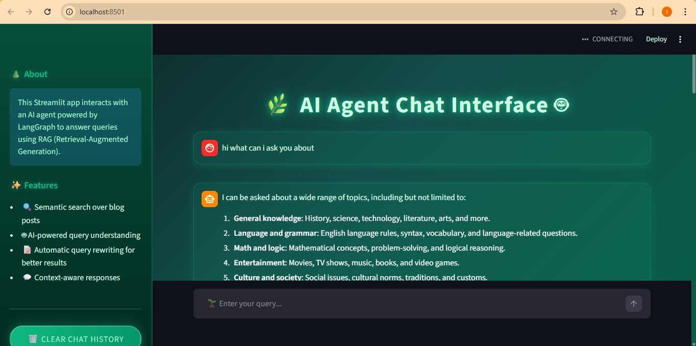
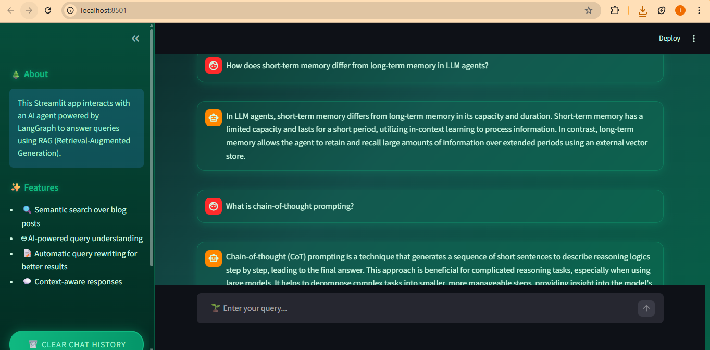
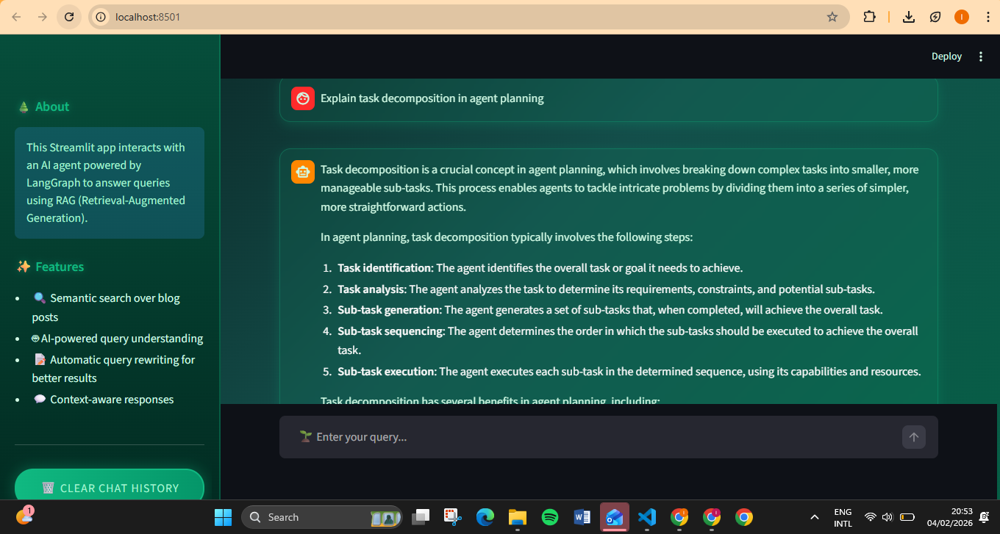

# AI Agent Chat Interface 🤖🌿

An intelligent chatbot powered by LangGraph and RAG (Retrieval-Augmented Generation) that answers questions about LLM agents and prompt engineering.

## Features

- 🔍 **Semantic Search** over blog posts
- 🤖 **AI-Powered** query understanding
- 📝 **Automatic Query Rewriting** for better results
- 💬 **Context-Aware** responses
- ⚡ **Powered by Groq** for fast inference
- 🌿 **Beautiful Forest-Neon UI**

## Tech Stack

- **Frontend:** Streamlit
- **AI Framework:** LangChain, LangGraph
- **LLM:** Groq (Llama 3.3 70B)
- **Embeddings:** HuggingFace (all-MiniLM-L6-v2)
- **Vector Store:** ChromaDB


.
├── app.py              # Main Streamlit application
├── agent_graph.py      # LangGraph agent logic
├── Dockerfile          # Docker image configuration
├── docker-compose.yml  # Docker compose setup
├── .env                # Environment variables (never commit!)
├── requirements.txt    # Python dependencies
├── .gitignore          # Git ignore rules
└── README.md           # This file
3. Build and run:
```bash
   docker compose up --build
```
4. Open your browser at `http://localhost:8501`

### Stop the app
```bash
docker compose down
```

## 💻 Run Locally (Without Docker)
1. Install dependencies:
```bash
   pip install -r requirements.txt
```
2. Add your API keys to `.env`
3. Run:
```bash
   streamlit run app.py
```
## API Keys Required

- **GROQ_API_KEY**: Free tier available at [Groq Console](https://console.groq.com)
- **LANGCHAIN_API_KEY**: For LangSmith tracing (optional)
- **TAVILY_API_KEY**: For web search capabilities (optional)

3. Build and run:
```bash
   docker compose up --build
```
4. Open your browser at `http://localhost:8501`

### Stop the app
```bash
docker compose down
```

## 💻 Run Locally (Without Docker)
1. Install dependencies:
```bash
   pip install -r requirements.txt
```
2. Add your API keys to `.env`
3. Run:
```bash
   streamlit run app.py
```

## Usage

1. Start the app with `streamlit run app.py`
2. Ask questions about:
   - LLM agents
   - Prompt engineering
   - Autonomous agents
   - Memory systems in AI
   - And more!

## Screenshots
## Screenshots






<!-- Add screenshots here later -->

